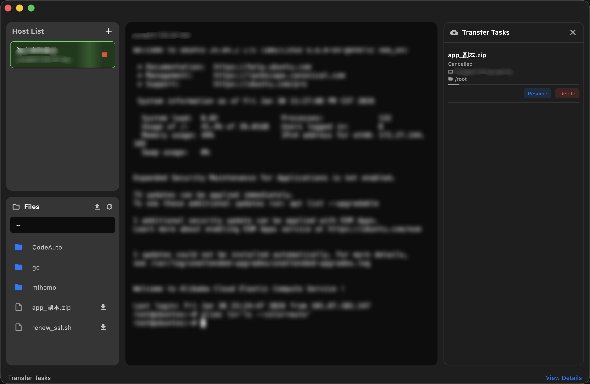

# Simple Term

## 系统支持 macos 26.2 (25C56)，其他没测试过，应该也支持。如果启动不了直接下载源文件丢给模型打包就行了。

一款简洁优雅的 macOS SSH 终端客户端。

## ✨ 功能特性

- **SSH 终端连接** - 快速连接远程服务器，支持密码认证
- **SFTP 文件管理** - 内置文件浏览器，轻松上传下载文件
- **主机管理** - 保存常用主机，一键连接
- **智能断线** - 5 分钟无操作自动断开，保持连接心跳

## 📦 安装

下载 DMG 文件，拖动到 Applications 文件夹即可。

## 📸 截图

## 🤖 关于这个项目

这个项目完全由 **AI 辅助开发**完成。从设计到编码，全程与 AI 结对编程。

如果你想要自定义功能：

1. Fork 或 Clone 这个仓库
2. 打开你喜欢的 AI 编程助手（如 Cursor、Copilot、Claude 等）
3. 告诉 AI 你想要什么功能
4. 让 AI 帮你实现！

这就是现代软件开发的方式 —— **你只需要有想法，AI 来帮你实现**。

## 📄 开源协议

本项目采用 [MIT License](LICENSE) 开源协议。

## 🤝 贡献

如果有其他的需求
欢迎提交 Issue 和 Pull Request！
不定期更新

---

Made with ❤️
